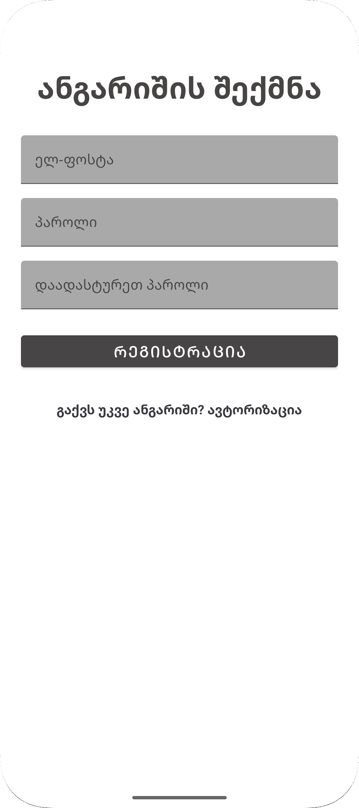

** Personal Journal App **
This is a simple Android app where you can keep a digital journal. It's built to be easy to use, secure, and keeps your thoughts synchronized across your devices.
This Application gives you freedom to easily organize your thoughts, plans, stories and etc.

--What It Does--
1) Easy Registration / Authorization with Modern UI
2) Write Anything, Create New Entries with a title, even you can type how you were feeling ( happy, sad, neutral)
3) Keep Track of all your journal entries in one place only
4) Edit your entries anytime you want.
5) Easy Acess to Delete Entries With One Click
6) Automatic Date Detection to know when you created your entry.
7) Offline Access - No Internet Required
8) Fits to any Phone & Tablet Screen Size
9) Smooth Design With Smooth Animations

--How Its' Built--
Application is Developed in Android Studio, Using Kotlin Language with a bunch of helpful tool from Android's modern Toolkit and Google Firebase Services:
- Kotlin is main language which is used in this app
- RecyclerView Which is used to show things like a list
- Navigation Component Handles all screen transitions
- ViewModel is used to keep data organized, even after rotation.
- LiveData helps app to react instantly to data changes
- Room Manages Local Journal data on device, which is perfect for offline use.
- ViewBinding Connects code to UI Elements
- Glide is used to take care about images, image loading and etc.

-- Firebase --
- Firebase Authentication Which Handles all tasks which is related to authorization / registration
- Firebase Realtime Database where all data is synced and saved.
- Firebase Storage Storages Profile Pictures

-Screenshots

### 📸 Screenshots

<h4>🔐 Login Screen</h4>

<h4>📝 Registration Screen</h4>

<h4>🏠 Home Screen</h4>

<h4>➕ Adding Entry</h4>

<h4>👤 Profile Page</h4>

<h4>🛠️ Edit/Delete</h4>

Open in Android Studio: Just open the project.
Create new project in firebase and add an android app to our new firebae project.
**Important** Enable Email/Password Authentication in Firebase and also Set Up Realtime Database
Then Run Application and Thats It, You Have Your Own Journal Simple and Straight to the Point!.
